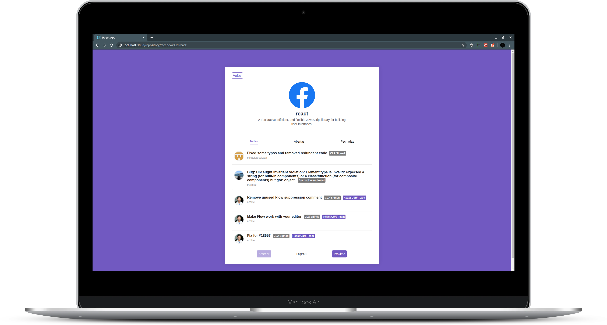

<h1 align="center">
    
</h1>

<blockquote align="center">“Your limitation—it's only your imagination.”</blockquote>

<p align="center">
  <a href="#bulb-about">About</a>&nbsp;&nbsp;&nbsp;|&nbsp;&nbsp;&nbsp;
  <a href="#computer-install">Install</a>&nbsp;&nbsp;&nbsp;|&nbsp;&nbsp;&nbsp;
  <a href="#boom-result">Result</a>&nbsp;&nbsp;&nbsp;|&nbsp;&nbsp;&nbsp;
  <a href="#memo-licença">License</a>
</p>

## :bulb: About

<p align="justify">in this application i created a react SPA for to consume git api, where we found a especific repository and visualized all the issues it has. Technologies used:</p>

- [React](https://reactjs.org/)

<p align="justify">and for code pattern i used:</p>

- [Eslint](https://eslint.org/)
- [Prettier](https://prettier.io/)

## :computer: Install

**Clone**
```
git clone https://github.com/victorvf/first-react.git
```

**React**

```
- yarn install

- yarn start
```

## :boom: Result

<h3 align="center">
    
</h3>

## :memo: License

this project is under the MIT license. See the archive [LICENSE](https://github.com/Rocketseat/bootcamp-gostack-desafio-03/blob/master/LICENSE.md) for more details.
